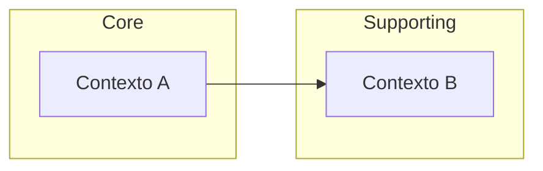

# {Nombre del producto} — Domain Benchmark & Gap Analysis

**Estado:** borrador / definitivo del Paso 0.
**Propósito:** material fuente único para Spec, MDD y gates locales.
**Modo:** `deep` (recomendado) | `standard` — ver `WORKFLOW.yaml` → `paso0.depth`.
**No es:** PRD final, SDD, backlog, runbook ni compromiso contractual.

> **Guía del agente:** leer `paso0/DEEP-PASO0-GUIDE.md` antes de rellenar. En modo **deep**, objetivo **≥40–60 D-IDs** y benchmark **800–2000 líneas**.

---

## 1. Reglas de lectura y gobierno

### 1.1 Qué es y qué no es este documento

Las decisiones vigentes son filas con tipo **Decisión confirmada** y vigencia **Vigente**.
Toda capacidad, riesgo y regla lleva su **identificador D-XXX**, **tipo de afirmación** y **regla** (Genérica / Específica / Genérica validada primero).

### 1.2 Tipos de afirmación

| Tipo | Significado |
|------|-------------|
| Decisión confirmada | Regla aprobada. Vinculante. |
| Inferencia aceptada | Conclusión derivada (p. ej. investigación de mercado). No vinculante hasta confirmar. |
| Propuesta | Opción para validación posterior. |
| Supuesto | Condición por validar. |
| Pregunta abierta | Bloqueante hasta resolver. |

### 1.3 Clasificaciones de capacidad

Solo: `MVP`, `Preparación arquitectónica`, `Posterior al MVP`, `Fuera de alcance`, `Pendiente de decisión`.

---

## 2. Síntesis ejecutiva

- **Problema:** …
- **Propuesta de valor:** …
- **MVP (1–2 párrafos):** qué se entrega en la primera versión funcional y qué métrica de éxito la valida.
- **Fuera de alcance explícito (mínimo 5 ítems):** …

---

## 3. Análisis de mercado y competencia

> **Modo deep:** investigar con búsqueda web. Marcar datos sin fuente como **Inferencia aceptada** o **Supuesto**.

### 3.1 Contexto de mercado

| Dimensión | Valor / estimación | Fuente / tipo |
|-----------|-------------------|---------------|
| TAM (opcional) | … | Inferencia / informe |
| SAM | … | … |
| SOM (MVP) | … | … |
| Segmento objetivo geográfico | … | Decisión confirmada |
| Tendencia / timing | … | … |

### 3.2 Competidores y comparables (mínimo 3, máximo 7)

| Competidor / comparable | Propuesta de valor | Modelo de ingresos | Fortalezas | Debilidades / gaps | D-IDs |
|-------------------------|-------------------|--------------------|------------|-------------------|-------|
| … | … | … | … | … | D-0xx |

### 3.3 Diferenciación y posicionamiento

- **Ventaja defendible del MVP:** …
- **Por qué ahora:** …
- **Barreras de entrada / moat inicial:** …

### 3.4 Contexto regulatorio y compliance (si aplica)

| Ámbito | Requisito | Impacto en MVP | D-IDs |
|--------|-----------|----------------|-------|
| … | … | … | D-0xx |

---

## 4. Personas y jobs-to-be-done

> **Mínimo 2 personas, máximo 4** en modo deep.

| Persona | Rol / contexto | Job-to-be-done principal | Dolores (pains) | Ganancias (gains) | D-IDs |
|---------|----------------|--------------------------|-----------------|-------------------|-------|
| … | … | … | … | … | D-0xx |

### 4.1 Journey crítico del MVP (happy path)

1. …
2. …
3. …

---

## 5. Modelo de negocio y unit economics

| Elemento | Definición MVP | Supuesto / métrica | D-IDs |
|----------|----------------|-------------------|-------|
| Modelo de ingresos | … | … | D-0xx |
| Pricing / comisión | … | … | D-0xx |
| CAC estimado (si aplica) | … | … | D-0xx |
| LTV / payback (si aplica) | … | … | D-0xx |
| Canales de adquisición MVP | … | … | D-0xx |

---

## 6. Visión, problema y límites (DDD)

### 6.1 El problema (profundizado)

…

### 6.2 Límites del producto

…

### 6.3 Mapa de contextos (bounded contexts)

| Contexto | Responsabilidad | Integración con otros | D-IDs |
|----------|-----------------|----------------------|-------|
| … | … | … | D-0xx |

---

## 7. Modelo operativo

> **Modo deep:** mínimo 6 filas — soporte, SLA, onboarding, fraude, disputas, escalamiento.

| Área operativa | Política MVP | SLA / umbral | D-IDs |
|----------------|--------------|--------------|-------|
| Soporte al usuario | … | … | D-0xx |
| Onboarding proveedor / partner | … | … | D-0xx |
| Moderación / fraude | … | … | D-0xx |
| Disputas / chargebacks | … | … | D-0xx |
| Incidentes y escalamiento | … | … | D-0xx |
| Backoffice / ops internas | … | … | D-0xx |

---

## 8. Production readiness checklist

> Cada fila debe generar al menos un **D-ID** (Decisión confirmada o Preparación arquitectónica). Objetivo deep: **≥12 ítems**.

| Área | Decisión MVP / v1 prod | Criterio verificable | D-IDs |
|------|------------------------|---------------------|-------|
| Autenticación y sesiones | … | … | D-0xx |
| Autorización (RBAC/ABAC) | … | … | D-0xx |
| Observabilidad (logs, métricas, trazas) | … | … | D-0xx |
| Alertas y on-call | … | … | D-0xx |
| Backups y restauración (RPO/RTO) | … | … | D-0xx |
| Entornos (dev/staging/prod) | … | … | D-0xx |
| Secretos y configuración | … | … | D-0xx |
| Rate limiting / abuse | … | … | D-0xx |
| CI/CD y despliegue | … | … | D-0xx |
| Compliance / privacidad (GDPR, retención) | … | … | D-0xx |
| Health checks y readiness | … | … | D-0xx |
| Plan de rollback | … | … | D-0xx |

---

## 9. Decisiones (registro D-ID)

> **Modo standard:** mínimo **~20 D-IDs**. **Modo deep:** mínimo **40–60 D-IDs** (objetivo 50–80).

| ID | Tipo | Clasificación | Regla | Afirmación |
|----|------|---------------|-------|------------|
| D-001 | Decisión confirmada | MVP | Genérica | … |

### 9.1 Decisiones de arquitectura (opcional — alimenta `architecturePatterns[]`)

| Patrón | Estado | Rationale | D-IDs |
|--------|--------|-----------|-------|
| … | activo / descartado | … | D-0xx |

---

## 10. Capacidades MVP

> **Mínimo 8 filas** en modo deep.

| Capacidad | D-IDs | Clasificación | Notas |
|-----------|-------|---------------|-------|
| … | D-001 | MVP | … |

---

## 11. Fuera de alcance

> **Mínimo 6 filas** en modo deep.

| Ítem | D-IDs | Motivo |
|------|-------|--------|
| … | D-00N | … |

---

## 12. Entidades canónicas (para §3 MDD)

> Listar **todas** las entidades que el MDD debe materializar en CREATE TABLE. **Mínimo 8** en modo deep.

| Entidad | Descripción breve | Contexto DDD | D-IDs |
|---------|-------------------|--------------|-------|
| … | … | … | D-0xx |

---

## 13. Familias de rutas API obligatorias (para §4 MDD)

> **Mínimo 6 familias** en modo deep. Cada familia con `pathPatterns` en el catálogo JSON.

| Familia (id) | Label | pathPatterns (ejemplos) | D-IDs |
|--------------|-------|-------------------------|-------|
| auth | Autenticación | `/api/v1/auth/login`, `/api/v1/auth/refresh` | D-0xx |
| … | … | … | D-0xx |

---

## 14. Reglas de negocio (BR-xxx → §5 MDD)

> **Mínimo 10 reglas** en modo deep. Sincronizar con `businessRules[]` del catálogo.

| ID | Regla | Trigger / condición | D-IDs |
|----|-------|---------------------|-------|
| BR-001 | … | … | D-0xx |

---

## 15. Requisitos no funcionales (cuantificados)

> **Mínimo 6 NFR** con cifra y unidad. Sincronizar con `nfrQuantified[]` del catálogo.

| ID | Categoría | Requisito medible | Objetivo | D-IDs |
|----|-----------|-------------------|----------|-------|
| NFR-001 | Latencia | p99 API lectura | < 300 ms | D-0xx |
| NFR-002 | Disponibilidad | uptime mensual | ≥ 99.5 % | D-0xx |
| NFR-003 | Recuperación | RPO / RTO | 15 min / 1 h | D-0xx |
| … | … | … | … | D-0xx |

---

## 16. Integraciones y terceros

| Integración | Proveedor / protocolo | Crítica MVP | Fallback | D-IDs |
|-------------|----------------------|-------------|----------|-------|
| … | … | sí / no | … | D-0xx |

---

## 17. Riesgos, supuestos y preguntas abiertas

### 17.1 Riesgos (mínimo 5 en modo deep)

| ID | Riesgo | Prob. | Impacto | Mitigación | D-IDs |
|----|--------|-------|---------|------------|-------|
| R-001 | … | … | … | … | D-0xx |

### 17.2 Supuestos clave

| ID | Supuesto | Cómo validar | D-IDs |
|----|----------|--------------|-------|
| A-001 | … | … | D-0xx |

### 17.3 Preguntas abiertas (bloqueantes)

| ID | Pregunta | Dueño | Fecha límite |
|----|----------|-------|--------------|
| Q-001 | … | … | … |

---

## 18. Glosario (Ubiquitous Language)

> **Mínimo 12 términos** en modo deep. Sincronizar con `entities[]` del catálogo.

| Término | Definición | D-IDs |
|---------|------------|-------|
| … | … | D-001 |

---

## 19. Sincronización con catálogo JSON

Tras editar este documento, actualizar `paso0/decisions.catalog.json` para que refleje **todas** las tablas anteriores:

| Campo catálogo | Origen en benchmark |
|----------------|---------------------|
| `decisions[]` | §9 |
| `mvpCapabilities[]` | §10 |
| `outOfScope[]` | §11 |
| `canonicalEntities[]` | §12 (solo nombres de entidad) |
| `entities[]` | §18 (glosario: term + decisionIds) |
| `mandatoryApiRouteFamilies[]` | §13 |
| `businessRules[]` | §14 |
| `risks[]` | §17.1 |
| `architecturePatterns[]` | §9.1 (solo patrones activos) |
| `rejectedPatterns[]` | §9.1 (patrones descartados) |
| `personas[]` | §4 (metadata opcional) |
| `competitors[]` | §3.2 (metadata opcional) |
| `nfrQuantified[]` | §15 (metadata opcional) |
| `productionChecklist[]` | §8 (metadata opcional) |

Validar coherencia: todo D-ID citado en tablas debe existir en `decisions[]` con `id`, `assertionType`, `classification` y `statement`.
